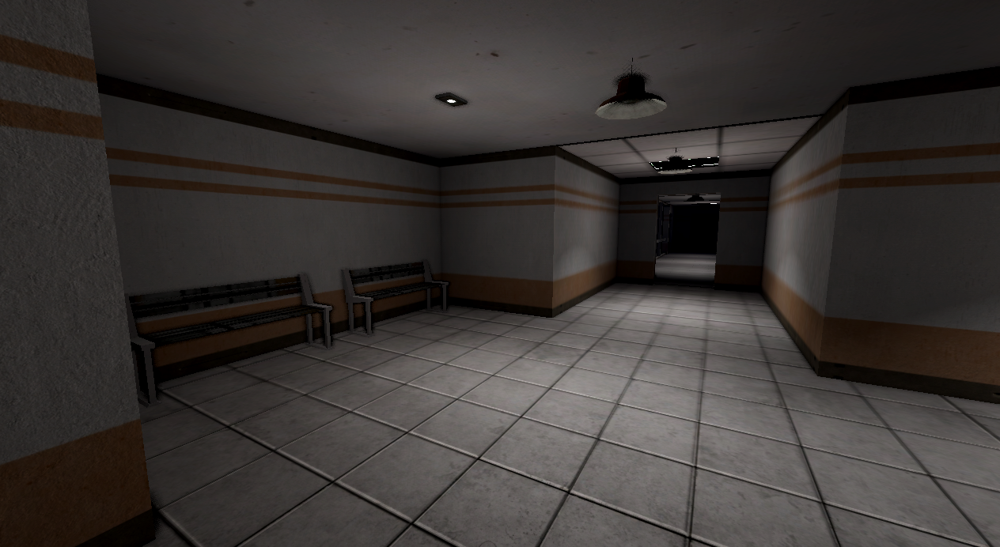
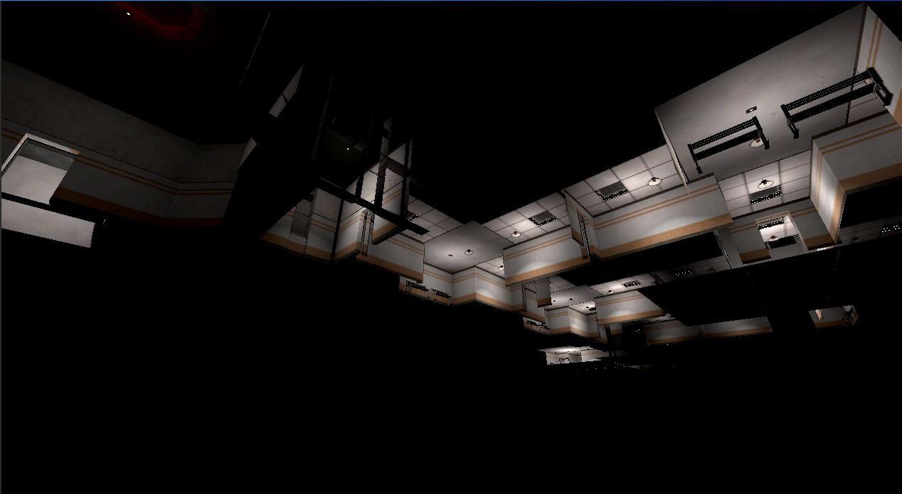

# SCP Multiplayer

## Overview

Project built on Godot Engine and was made as a project that can be easily customized and updated.

Project consists of:
- `RoundSystem` that automatically processess multiple stages `INTERMISSION, LOADING, ON_GOING, FINISHED, LOCKED`. Round System each new round calls for random facility generation then spawns appropriate teams with players.
- `MapGenerator` generates required Containment Zone and setups data for the `RoundSystem` (spawn points of the teams, places at which the items will be spawned and etc.)
- `Team` and `TeamClass` system. `Team` may contain its own team classess. Therefore `TeamClass` can be used for e.g. assigning ranks (`Team` - MTF; `TeamClass` - MTF Commander, `TeamClass` - MTF Lieutenant, `TeamClass` - MTF Cadet).
- `Ability` system. `TeamClass` and `Team` may have `Ability`(s) assigned to them. For example, Class-D (`Team`) team can have ability to trigger SCP-096 (`TeamClass` because SCP is `Team`) and SCP-096 can have ability to be triggered

Containment Zones, Teams, Team Classess, Abilities can be easily customized using the pre-made resource system.

Random facility generation can be easily customzed and consists of multiple resources. Just create new `ContainmentZone` `.tres` resource and change the settings of it.
Then add rooms that will be placed during generation. Just create `RoomModel` `.tres` resources with the appropriate settings (e.g. room can be spawned only once and etc.) and scenes of the rooms.
Then apply it to `RoundSettings` as a Containment Zone.

### How generated facilty looks inside

### How generated facility looks outside

## Documentation

Full documentation for this project is available in (docs/)[docs/] directory.

# Contribution

## Can I contribute?

Yes! If you are a coder feel free to *Fork* the repository and send your amazing Pull Requests!

## How should I contribute?

Godot Engine alerady has clear PEP8 code style guidelines, so it's difficult to add something to it, but there are certain key points to follow when contributing:
- PEP8 code style guidelines should always be followed. In advance check [Godot Engine Documentation](https://docs.godotengine.org/en/stable/tutorials/scripting/gdscript/gdscript_styleguide.html) for more information.
- Always try to reference issues in commit messages or pull requests ("related to #614", "closes #619" and etc.).
- Avoid huge code commits where the difference can not even be rendered by browser based web apps (Github for example). Smaller commits make it much easier to understand why and how the changes were made, why (if) it results in certain bugs and etc.
- If there's a reason to commit code that is commented out (there usually should be none), always leave a "FIXME" or "TODO" comment so it's clear for other developers why this was done.

# Branches

- `main` - production ready codebase
- `dev` - completed but not yet released changes

Other branches should be prefixed similarly to commits, like `docs/added-usage-readme`.
