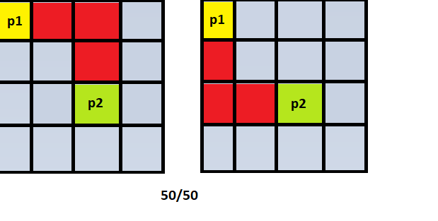
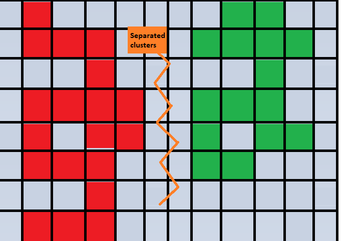

# Facility Generation

Facility generation happens in the `MapGenerator` class and consists of simple things.

## Random Generation algorithm

Facility generation consists in following order: Connecting random points, Setting room types, Placing room models, Placing doors, Spawning items in rooms.

### Random point connection

1. At first two random points are selected within the grid. If checkpoint room must be present in the generated Containment Zone then second random point will be choosen as the point at which the checkpoint room is supposed to be. (Checkpoint rooms are spawned NOT in the Containment Zone grid. Instead, it is spawned outside the great. Therefore when trying to connect two Containment Zones ensure that some space is left for Checkpoint rooms to be placed)
2. Then at 50/50 chance connection may differ. In can be: coming from first selected point it will first go horizontally closer to the second selected point and only then go vertically closer to the second selected point.  And it can be: coming from first selected point it will first go vertically closer to the second selected point and only then go horizontally closer to the second selected point. Second selected point is then returned for next steps.

4. Amount of hallways (`var hallways = 0;`) based on the `grid_width` and `grid_height` is determined.
5. Then previous second selected point is next used as a first selected point for connection with a new randomly selected second point. It happens according to `for i in range(0,(hallways)/2)` amount of times. Important to note that instead of only selecting new random point and connecting it with the previous one, this generator also starts new for loop after first `for i inrange(0,(hallways)/2)`. In this second loop it selects absolutely new random point and connects it with the new random points.

Each selected random point is checked for uniqueness and for minimum hallway length.

**IMPORTANT NOTE:** Unfortunately, because of the way generation works. It is important to keep grid size small. Otherwise there may be cases of separated clusters of hallways that are not connected at all to each other.

### Setting room types

The order in which the room types are set is crucial for this generator.
Room types are set in this following order:
1. Find and place Corner rooms.
2. Find and place Intersection rooms.
3. Find and place T-Intersection rooms.
4. Find and place Hallway rooms.
5. Find and place Dead End rooms.

`MapGenerator` also checks if there needs to be more Dead Ends than were actually generated. It was made to ensure that *special* Dead Ends rooms placed in `ContainmentZone` `.tres` resource file will be spawned no matter what. Other types of rooms do not have this proper check. For example, If there is not enough amount of Hallway rooms generated then not all *special* Hallway rooms will be spawned.

### Placing room models

Room models are used from the `ContainmentZone` `.tres` file which is used to generate this Containment Zone.

### Door placement

Door placement is special. Instead of having specific `Vector3` points at which the door frame in the actual room model is present, we use only one central point of the actual room model. Door model is located in the `DoorFrameModel` class. Actual door model is offset'd from the center of the room model. During door placement the door model is rotated around the center point of the room model according to the room type.
